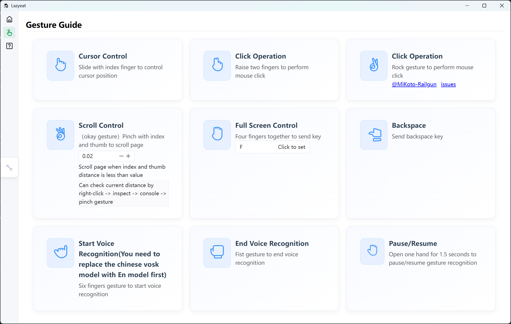

# Lazyeat

</a>

<h3>English | <a href="README_CN.md">简体中文</a> </h3>

## Guide

💬 Join [QQ Group](https://github.com/lanxiuyun/lazyeat/discussions/86)

Lazyeat is a contactless control tool based on gesture recognition. It supports camera gesture operations and voice input, making it convenient for users to use the device without getting their hands dirty while eating.

## Why Lazyeat?

- Hands-free convenience: Allows operation of devices without touching them, perfect for greasy hands while eating.
- Intuitive gesture control: Simple gestures (like swiping, clicking) make it easy to pause videos, adjust volume, or navigate, requiring minimal learning.
- Multi-platform support: Works on both Windows and Mac, ensuring compatibility across common operating systems.
- Enhanced user experience: Eliminates the hassle of cleaning hands repeatedly, streamlining activities like watching videos during meals.
- Voice input integration: Adds flexibility by supporting voice commands alongside gestures, catering to diverse user preferences.

## Screenshots

> Video Demo: https://www.bilibili.com/video/BV11SXTYTEJi/?spm_id_from=333.1387.homepage.video_card.click

## How to Use?

### Download

Currently supports Mac, Windows, and Linux. Thanks to Tauri2's cross-platform capabilities, it will support iOS and Android in the future.

| Windows | MacOS | Linux     | Android   | iOS       |
| --- | --- |-----------|-----------|-----------|
| ✅ beta | ✅ beta | 🛠️ alpha | 🛠️ alpha | 🛠️ alpha |
| [Download](https://download.upgrade.toolsetlink.com/download?appKey=zY0JIMn9x6W7vCs4P1mtgQ) | [Download](https://download.upgrade.toolsetlink.com/download?appKey=zY0JIMn9x6W7vCs4P1mtgQ) | ❌         | ❌         | ❌         |

> [UpgradeLink offers application upgrade and download services](http://upgrade.toolsetlink.com/upgrade/example/tauri-example.html)

## Contribute

- [Read contribution guide(Quick Start)](contribution_en.md) | [阅读贡献指南(快速开始)](contribution.md)

## Contributors

## Sponsors

  

