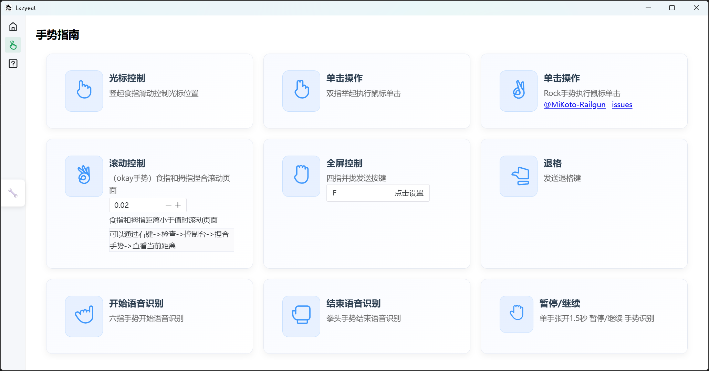
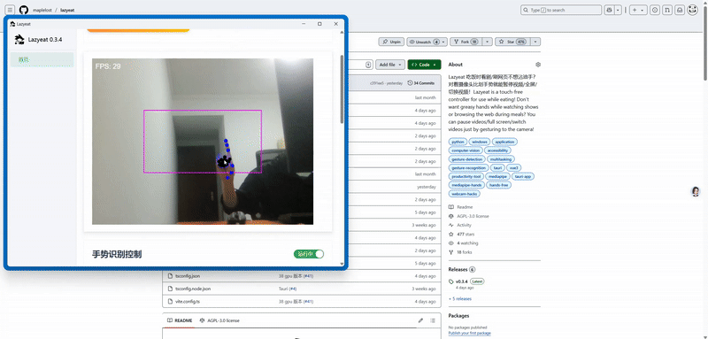

# Lazyeat

</a>

<h3><a href="README.md">English</a> | 简体中文 </h3>

## 指南

💬 加入 [QQ群](https://github.com/lanxiuyun/lazyeat/discussions/86)

Lazyeat 是一款基于手势识别的非接触式控制工具。它支持摄像头手势操作和语音输入，使用户在进食时可以方便地使用设备而不弄脏手。

## 为什么选择 Lazyeat？

- 免手操作便利性：允许在不接触设备的情况下操作，非常适合手上有油脂的情况。
- 直观的手势控制：简单的手势（如滑动、点击）可以轻松暂停视频、调整音量或导航，学习成本极低。
- 多平台支持：在 Windows 和 Mac 上都能工作，确保跨常用操作系统的兼容性。
- 增强用户体验：消除重复清洁双手的麻烦，简化用餐时观看视频等活动。
- 语音输入集成：通过支持语音命令，为不同用户偏好提供灵活性。

## 截图

> 视频演示: https://www.bilibili.com/video/BV11SXTYTEJi/?spm_id_from=333.1387.homepage.video_card.click

## 如何使用？

### 下载

目前支持 Mac、Windows 和 Linux。感谢 Tauri2 的跨平台能力，未来将支持 iOS 和 Android。

| Windows | MacOS | Linux     | Android   | iOS       |
| --- | --- |-----------|-----------|-----------|
| ✅ 测试版 | ✅ 测试版 | 🛠️ 内测版 | 🛠️ 内测版 | 🛠️ 内测版 |
| [下载](https://download.upgrade.toolsetlink.com/download?appKey=zY0JIMn9x6W7vCs4P1mtgQ) | [下载](https://download.upgrade.toolsetlink.com/download?appKey=zY0JIMn9x6W7vCs4P1mtgQ) | ❌         | ❌         | ❌         |

> [UpgradeLink 提供应用程序升级和下载服务](http://upgrade.toolsetlink.com/upgrade/example/tauri-example.html)

## 贡献

- [阅读贡献指南(快速开始)](contribution.md)

## 贡献者

## 赞助商

  

