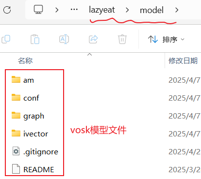
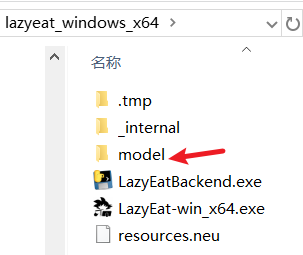

# Quick Start

```
# Version Information (Development Environment)
\Desktop\lazyeat> python --version
Python 3.11.11
(Note: As of April 19, 2025, pyinstaller packaging will fail with Python 3.12.7 and above)

Desktop\lazyeat> rustc --version
rustc 1.85.1 (4eb161250 2025-03-15)

\Desktop\lazyeat> node --version
v22.14.0
```

### Install Rust and Node

Install [Rust](https://www.rust-lang.org/tools/install) and [Node](https://nodejs.org/)

### Open Project in Root Directory

Open the project in the root directory (i.e., lazyeat root directory)
(e.g., C:\Users\YourUsername\Desktop\lazyeat, or open the folder and type cmd in the address bar)

### Install pnpm and Python Environment

```bash
npm install -g pnpm
pnpm install-reqs
```

If you encounter issues, try running the command in administrator mode.

### Build Tauri Icons

```bash
pnpm build:icons
```

### Pyinstaller Packaging

```bash
pnpm build:py
# For Mac version
# pnpm build:py-mac
# For Linux version
# pnpm build:py-linux
```

### Download Voice Recognition Model

Download and extract to the model folder:
```bash
https://alphacephei.com/vosk/models/vosk-model-small-cn-0.22.zip
```



### Run Tauri Dev Environment

```bash
pnpm tauri dev
```

### Additional Notes

#### Production Build (Optional)

```bash
pnpm tauri build
```

After building, find the executable in the **lazyeat\src-tauri\target\release** directory.

#### Python Backend Debug

If you need to debug the Python backend, first use pyinstaller to package, then run `python src-py/main.py`.

`pnpm tauri dev` requires generating the sidecar written in [tauri.conf.json](src-tauri/tauri.conf.json).
See: https://v2.tauri.app/develop/sidecar/

# 📢 Voice Recognition Model Replacement

[Small Model](https://alphacephei.com/vosk/models/vosk-model-small-cn-0.22.zip) [Large Model](https://alphacephei.com/vosk/models/vosk-model-cn-0.22.zip)

The steps above download the small model. If you need to use the large model, download and extract it to `model/` to replace the existing one.



# Development Issues

## Tauri Build Issues

If you encounter build failures with Tauri, check out this
issue: [tauri build failure](https://github.com/tauri-apps/tauri/issues/7338)

If the build fails, check if the size of src-tauri/bin exceeds 200MB. If it does, verify that your Python environment is correctly set up.

## Cargo Network Issues

If you're experiencing network issues with Cargo (common in some regions), you can try changing the
source: [cargo blocked, change source](https://www.chenreal.com/post/599)

```bash
# May or may not help
rm -rf ~/.cargo/.package-cache
```

[Non-code Exception Issues Summary](https://github.com/maplelost/lazyeat/issues/30)
